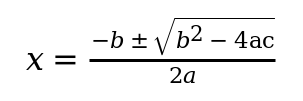
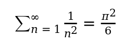
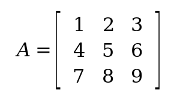

= Lasem: Ruby bindings for the Lasem MathML and SVG renderer

image:https://img.shields.io/gem/v/lasem.svg[Gem Version, link=https://rubygems.org/gems/lasem]
image:https://img.shields.io/github/license/plurimath/lasem-ruby.svg[License]

== Purpose

`lasem` is a Ruby native extension that wraps the
https://wiki.gnome.org/Projects/Lasem[Lasem] C library to render mathematical
notation and SVG. It parses MathML, SVG, or Lasem-supported itex/LaTeX input
and emits SVG, PNG, PDF, or PostScript through Lasem's existing layout
pipeline.

The gem keeps the Ruby layer focused on input validation, ergonomic entry
points, and predictable errors. Parsing, layout, and rendering are delegated
to Lasem.

`lasem` is intended for Ruby applications that need an embeddable interface to
Lasem-supported rendering without shelling out to the `lasem-render`
executable.

The source repository is named `lasem-ruby` to make the language binding
clear; the gem itself is named `lasem` because the public Ruby API is already
namespaced as `Lasem`.

[#prerequisites]
== Prerequisites

`lasem` is a native extension. Ruby 3.3 or newer is required, and the upstream
Lasem C library must be available for rendering support.

The released gem does not package or build the upstream Lasem C library. If
Lasem is missing when the gem is installed, installation can still succeed with
a stub extension, but `Lasem.render` raises `Lasem::DependencyError` until
Lasem is installed and the extension is rebuilt.

Install your operating system's Lasem development package when one is
available. The package lists below cover the Ruby native extension toolchain,
the vendored Lasem source-checkout build, and fonts commonly needed for math
rendering.

=== Debian or Ubuntu

[source,sh]
----
sudo apt-get install build-essential ruby-dev pkg-config meson ninja-build \
  bison flex gettext libglib2.0-dev libgdk-pixbuf-2.0-dev libcairo2-dev \
  libpango1.0-dev libxml2-dev fonts-lyx
----

=== Fedora

[source,sh]
----
sudo dnf install gcc ruby-devel pkgconf-pkg-config meson ninja-build \
  bison flex gettext glib2-devel gdk-pixbuf2-devel cairo-devel pango-devel \
  libxml2-devel lyx-fonts
----

Run `lasem-doctor --all-warnings` after installation if rendering is
unavailable or the gem reports missing native dependencies.

== Installation

Add to your application's Gemfile:

[source,ruby]
----
gem "lasem"
----

Then:

[source,sh]
----
bundle install
----

Or install directly:

[source,sh]
----
gem install lasem
----

Lasem itself is a native C library and is not bundled with the gem. See
<<prerequisites,Prerequisites>> before installing the gem.

== Quick start

[source,ruby]
----
require "lasem"

png = Lasem.render(
  "$x = \\frac{-b \\pm \\sqrt{b^2 - 4ac}}{2a}$",
  input: :latex,
  output: :png,
  ppi: 192.0,
)

File.binwrite("quadratic.png", png)
----

Output:

== Usage

=== `Lasem.render`

[source,ruby]
----
Lasem.render(source, input: :xml, output: :svg, **options) # => String
----

Returns the rendered output as a binary string in the requested format.

==== Options

`input`::
  Source language. One of `:xml`, `:mathml`, `:svg`, `:latex`, `:itex`.
  Default `:xml`. `:xml`, `:mathml`, and `:svg` are equivalent: all are parsed
  by Lasem's XML document parser, which auto-detects MathML vs SVG from the
  document. `:latex` and `:itex` are passed unchanged to Lasem's itex parser;
  the gem does not infer or add math delimiters.

`output`::
  Target format. One of `:svg`, `:png`, `:pdf`, `:ps`. Default `:svg`.

`ppi`::
  Pixels per inch used for rasterized output. Positive float. Default `72.0`.

`zoom`::
  Render scale factor. Positive float. Default `1.0`.

`width`, `height`::
  Optional fixed output dimensions in user units. Must be supplied together.
  Default `nil` (use Lasem's natural size).

`offset_x`, `offset_y`::
  Optional translation in user units. Default `0.0`. At the default `zoom: 1.0`
  the on-canvas displacement equals the offset; with a non-default `zoom` the
  offset is applied in the zoom-scaled coordinate system, so the effective
  displacement also scales with `zoom`.

=== `Lasem.native_available?`

Returns `true` when the native extension is linked against a usable Lasem
build. Returns `false` when only the stub fallback is loaded; in that case
`Lasem.render` raises `Lasem::DependencyError`.

== Examples

.LaTeX → PNG (Basel problem)
[example]
====
[source,ruby]
----
Lasem.render(
  "$\\sum_{n=1}^{\\infty} \\frac{1}{n^2} = \\frac{\\pi^2}{6}$",
  input: :latex,
  output: :png,
  ppi: 192.0,
)
----

====

.LaTeX → PNG (Gaussian integral)
[example]
====
[source,ruby]
----
Lasem.render(
  "$\\int_{0}^{\\infty} e^{-x^2}\\,dx = \\frac{\\sqrt{\\pi}}{2}$",
  input: :latex,
  output: :png,
  ppi: 192.0,
)
----

====

.MathML → PNG (3×3 matrix)
[example]
====
[source,ruby]
----
mathml = <<~XML
  <math xmlns="http://www.w3.org/1998/Math/MathML" display="block">
    <mrow>
      <mi>A</mi>
      <mo>=</mo>
      <mfenced open="[" close="]">
        <mtable>
          <mtr><mtd><mn>1</mn></mtd><mtd><mn>2</mn></mtd><mtd><mn>3</mn></mtd></mtr>
          <mtr><mtd><mn>4</mn></mtd><mtd><mn>5</mn></mtd><mtd><mn>6</mn></mtd></mtr>
          <mtr><mtd><mn>7</mn></mtd><mtd><mn>8</mn></mtd><mtd><mn>9</mn></mtd></mtr>
        </mtable>
      </mfenced>
    </mrow>
  </math>
XML

Lasem.render(mathml, input: :mathml, output: :png, ppi: 192.0)
----

====

.MathML → SVG
[example]
====
[source,ruby]
----
svg = Lasem.render(mathml, input: :mathml, output: :svg)
File.write("equation.svg", svg)
----
====

The script that produced the images above is at
link:docs/images/render_samples.rb[`docs/images/render_samples.rb`].

[#native-dependency]
== Native dependency resolution

The released gem does not package or build the upstream Lasem C library.
Install Lasem before installing this gem when possible, so the native
extension can link against it at install time.

The native build resolves Lasem in this order:

. A source-checkout vendored Lasem install under `vendor/lasem/install`, when present.
. A system Lasem package discovered with `pkg-config`.
. A compiled stub extension that raises `Lasem::DependencyError` when called.

Released gems do not include the vendored Lasem source, so installed gems
normally resolve Lasem through the system `pkg-config` path.

The stub keeps `require "lasem"` working on machines that do not have Lasem
yet, while making rendering failures explicit.

If the gem was installed before Lasem was available, rebuild the native
extension once Lasem is in place:

[source,sh]
----
gem pristine lasem --extensions
----

With Bundler:

[source,sh]
----
bundle pristine lasem
----

For a source checkout:

[source,sh]
----
bundle exec rake clean compile
----

Verify the result:

[source,sh]
----
ruby -rlasem -e 'p Lasem.native_available?'
----

== Troubleshooting

Run the bundled doctor:

[source,sh]
----
bundle exec lasem-doctor --all-warnings
----

It reports missing executables and missing pkg-config packages, and with
`--all-warnings` (or `--lasem-conflict-warnings`) it also reports submodule and
setup state. The line `Required dependencies look available.` is printed when
the required toolchain is present; any warnings are listed after the status
section. A successful dependency check does not by itself guarantee the native
extension is built -- verify that separately with `Lasem.native_available?`.

The same checks are available through Rake, where the `WARNINGS` variable maps
to the CLI flags: `WARNINGS=all` (all warnings), `WARNINGS=lasem` (Lasem setup
warnings), `WARNINGS=deps` (dependency warnings):

[source,sh]
----
bundle exec rake lasem:doctor WARNINGS=all
----

If `Lasem.render` raises `Lasem::DependencyError`, the gem is loading the stub
extension. Rebuild after installing Lasem (see <<native-dependency>>).

[#vendored-lasem]
== Vendored Lasem (source checkout)

The vendored build is a development helper for source checkouts. It is not
part of normal gem installation.

[source,sh]
----
git submodule update --init vendor/lasem/source
bundle exec rake lasem:doctor
bundle exec rake lasem:build
bundle exec rake clean compile
----

The build task installs Lasem into `vendor/lasem/install`. The native
extension adds that install's `pkgconfig` directory to `PKG_CONFIG_PATH` and
embeds the vendored library directory as a runtime library path.

The vendored Lasem source is licensed under LGPL-2.1-or-later. Keep Lasem's
license files with the vendored source when updating it.

== Development

Ruby 3.3 or newer is required.

[source,sh]
----
bundle install
bundle exec rake          # runs RSpec
bundle exec rubocop
----

Rendering specs are skipped unless the native extension is built against a
usable Lasem. In a source checkout, build the vendored Lasem first (see
<<vendored-lasem,Vendored Lasem (source checkout)>>) — that is the development
step that requires `git submodule update --init vendor/lasem/source`.

Environment variables understood by the build:

`LASEM_PKG_CONFIG`::
  Override the pkg-config package name (for example `lasem-0.6`).

`LASEM_SOURCE_DIR`::
  Override the vendored source directory used by `rake lasem:build`.

`LASEM_BUILD_DIR`::
  Override the Meson build directory used by `rake lasem:build`.

`LASEM_INSTALL_DIR`::
  Override the install prefix used by `rake lasem:build` and the native
  extension.

== Copyright and license

Copyright https://www.ribose.com[Ribose].

`lasem` (the Ruby gem) is licensed under the BSD 2-Clause license. See
link:LICENSE.txt[LICENSE.txt] for details.

The vendored Lasem C library is licensed under LGPL-2.1-or-later. Its license
files ship with the vendored source under `vendor/lasem/source/`.
